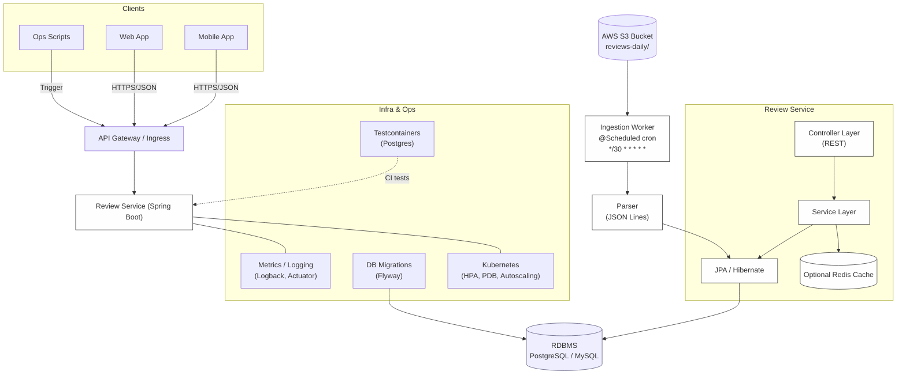
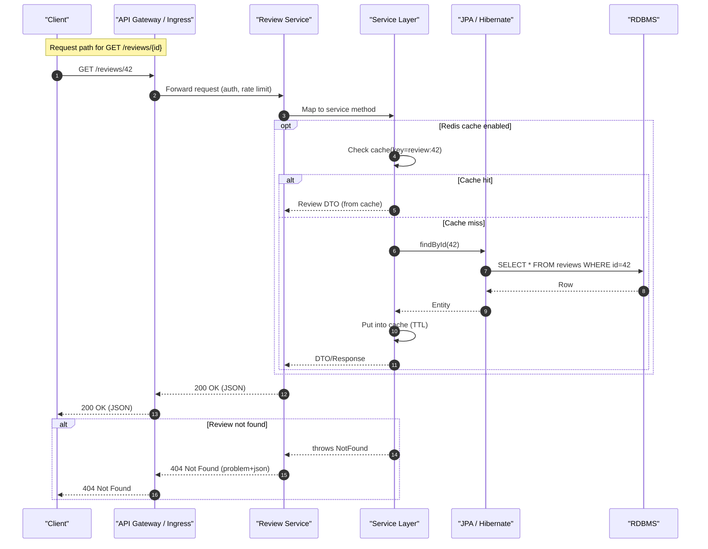

# ZUZU Review Service (Spring Boot, Java 8)

A microservice that ingests hotel reviews from AWS S3 (JSON Lines), validates/transforms, and stores into PostgreSQL.
Includes scheduler, REST trigger, idempotent file processing, Docker images, and docker-compose for a full local run.

## Features
- Java 8 / Spring Boot 2.7.x
- S3 listing + download (AWS SDK v2)
- JSONL streaming parse (Jackson)
- Validation (required fields)
- Idempotency:
  - `processed_files` table (S3 key + etag)
  - Unique `(provider_id, external_review_id)` for reviews
- Schema via Flyway (providers, hotels, reviews, review_aspects, processed_files)
- Scheduler (`cron`) + REST endpoint to trigger
- Concurrency for file processing
- Logging + basic error handling
- Dockerfile and docker-compose

## Quick Start (Docker Compose)

### Prereqs
- Docker + Docker Compose
- AWS credentials with `s3:ListBucket` and `s3:GetObject` on your bucket

### 1) Edit config
Update `src/main/resources/application.yml`:
```yaml
app:
  ingestion:
    s3-bucket: YOUR_BUCKET_NAME
    s3-prefix: reviews-daily/
aws:
  region: ap-southeast-2
```
Export credentials (or use `~/.aws/credentials`):
```bash
export AWS_ACCESS_KEY_ID=...
export AWS_SECRET_ACCESS_KEY=...
export AWS_REGION=ap-southeast-1
```

### 2) Build & Run
```bash

# Build docker image
docker build -t zuzu/review-service:0.1.0 .

# Start DB + app
docker compose up
```

The app will run Flyway migrations, then start the scheduler.
Manual trigger:
```bash
curl -X POST http://localhost:8080/api/ingest/run
```

### 3) Stop
```bash
docker compose down -v
```


## Configuration
- `app.ingestion.poll-cron` controls schedule (default: every 15 minutes).
- `app.ingestion.max-concurrent-files` controls parallel S3 files processed.

## Testing
```bash
docker compose -f docker-compose.test.yml up --abort-on-container-exit --exit-code-from maven-tests
```


## Endpoints
- `POST /api/ingest/run` — process all new files
- `POST /api/ingest/file?key=...` — process a single S3 key
- `GET /api/reviews/hotel/{hotel_id}` - api to fetch hotel reviews

## Design Decisions
- **Idempotency**: `processed_files` per S3 key/etag and unique constraint on provider+external_review_id.
- **Extensibility**: Separate `review_aspects` table for arbitrary aspect ratings; raw JSON stored for forward compatibility.
- **Validation**: Minimal required fields; malformed lines logged and skipped.
- **Concurrency**: Fixed thread pool sized via config for predictable resource usage.
- **Resilience**: Errors in one file do not stop others; per-row errors logged.
- **Support for multiple third-party providers**: The system can handle multiple providers like agoda, booking etc

## Folder Structure
```
zuzu-review-service/
  src/main/java/com/zuzu/reviews/...
  src/main/resources/db/migration/V1__init.sql
  Dockerfile
  docker-compose.yml
```

## Architecture Diagram


## Sequence Diagram


## Notes
- This project uses AWS default credential provider chain; when running in Docker, pass env vars via compose.

